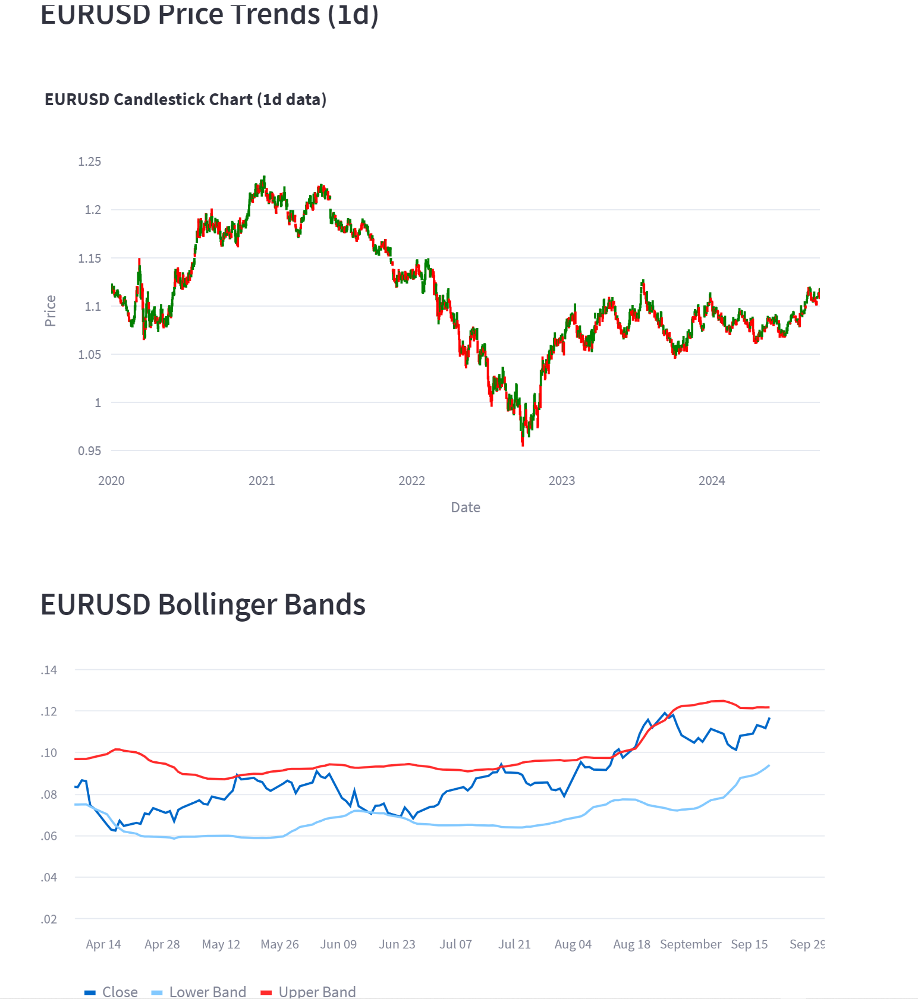

# CurrencyLens 

## Overview

CurrencyLens is a web-based tool designed for real-time analysis of Forex pairs. Developed using Streamlit, yfinance, Prophet, scikit-learn, matplotlib, and plotly, this dashboard provides a wide range of financial analyses on currency markets. Users can fetch historical data and apply various analytical techniques, including:

    - Price trend analysis
    - Daily returns calculations
    - Rolling statistics (e.g., moving averages)
    - Bollinger Bands for volatility assessment
    - Machine learning-based price prediction
    - Monte Carlo simulations for future price forecasting
    - Time-series forecasting using the Prophet model
    - Stationarity tests with the Augmented Dickey-Fuller test
    - Correlation matrix analysis across multiple currency pairs

CurrencyLens offers a user-friendly interface for traders and analysts to explore Forex pairs and visualize their findings through interactive charts and data visualizations.

## Features

- Candlestick Chart: Visualize the price trends for various Forex pairs over selected time intervals.

- Daily Returns: Calculate and display the daily returns of the selected Forex pair.

- Rolling Statistics: Compute and display the rolling mean and standard deviation of the closing prices for the selected pair.

- Bollinger Bands: Calculate and plot Bollinger Bands to assess price volatility.

- Price Prediction: Use Linear Regression to predict future prices based on historical data.

- Monte Carlo Simulation: Simulate potential future price movements based on historical volatility.

- Prophet Forecasting: Perform future price forecasting using the Prophet model.

- Augmented Dickey-Fuller Test: Test for stationarity in time-series data to determine if a series is mean-reverting.

- Correlation Matrix: Display a correlation matrix between the closing prices of different Forex pairs.

## Technology Stack

- Python: The backend programming language.

- Streamlit: Web framework for creating the dashboard.

- yfinance: Library used to fetch Forex data from Yahoo Finance.

- matplotlib & plotly: Libraries for visualizing data with static and interactive charts.

- Prophet: Library used for forecasting time series data.

- scikit-learn: Used for machine learning-based price prediction.

- seaborn: Visualization library for creating the correlation matrix heatmap.

## Installation

- Install the Required Libraries: Install the necessary dependencies using pip:
        
        - pip install -r requirements.txt

## Usage

- Open the dashboard in your browser at http://localhost:8501.
- In the sidebar:
        - Select a Forex Pair: Choose the Forex pair you want to analyze.
        - Select a Date Range: Set the start and end dates for the analysis.
        - Select a Time Interval: Choose the timeframe for the data (e.g., 1 minute, 1 day, 1 week).
        - Choose an Analysis: Pick from options like Daily Returns, Rolling Statistics, Bollinger Bands, etc.
        
Visualizations and analysis results will be displayed interactively in the main window.

## Key Features Breakdown
- Candlestick Chart
        - Visualizes the open, high, low, and close prices for the selected Forex pair.
- Interactive chart with zoom and drag options.

- Daily Returns
        - Calculates and displays the percentage change in the daily closing prices.

- Rolling Statistics
        - Computes the rolling mean and standard deviation of closing prices for the selected window size.

- Bollinger Bands
        - Plots upper and lower Bollinger Bands to provide insights into price volatility.

- Price Prediction
        - Implements Linear Regression to predict future prices based on historical data.
        - Plots the actual vs. predicted prices and calculates the Mean Squared Error (MSE) of the predictions.

- Monte Carlo Simulation
        - Simulates possible future price paths based on historical volatility using Monte Carlo techniques.
        - Visualizes multiple simulated price paths.

- Prophet Forecasting
        - Uses the Prophet model for time-series forecasting, providing an intuitive future price prediction with confidence intervals.
        - Visualizes the forecast and its components (trend, seasonality).

- Augmented Dickey-Fuller Test
        - Tests for stationarity in the time series, helping determine whether the price series is mean-reverting or trending.

- Correlation Matrix
        - Displays a heatmap of the correlation matrix between the closing prices of multiple Forex pairs.
        - Useful for identifying relationships and co-movements between different pairs.

## Screenshots

## Contributing
Contributions are welcome! If you'd like to contribute, please fork the repository and submit a pull request. Please make sure to follow the style and coding standards.